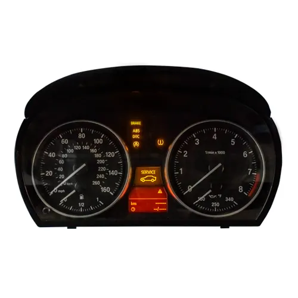

# Instrument Cluster — CAN Bus Simulation (Only Simulation)

> ⚠️ **This project is no longer maintained.** The repository is archived for reference only.

**MATLAB/Simulink simulation of CAN messages for a BMW E9x instrument cluster.**

Developed as part of the Master's course *Embedded Systems und Vernetzung mechatronischer Systeme* (Mechatronics & Robotics, Frankfurt UAS, WiSe 2024/2025).



---

## System Architecture

```
┌─────────────────────────────┐
│  Simulink Signal Generator  │  (Sim_Signale.slx)
│  - Speed ramp               │
│  - RPM sine wave            │
│  - Fuel level step          │
│  - Temperature, indicators  │
└──────────────┬──────────────┘
               │ Simulink CAN Pack / CAN Write blocks
               ▼
┌──────────────────────────────┐
│  Vehicle Network Toolbox     │  CAN channel (virtual or hardware)
│  CAN channel (Peak/IXXAT/…)  │
└──────────────┬───────────────┘
               │ Physical / virtual CAN bus
               ▼
┌──────────────────────────────┐
│  BMW E9x Instrument Cluster  │  (target hardware)
└──────────────────────────────┘
```

---

## Technical Overview

| Layer | Technology |
|---|---|
| Signal definition | DBC file (`E9x_KOMBI_V07.dbc`) |
| Simulation model | MATLAB/Simulink (`Sim_Signale.slx`) |
| CAN transmission | MATLAB Vehicle Network Toolbox |
| Project management | MATLAB Project (`.prj`) |

The `E9x_KOMBI_V07.dbc` file defines all CAN messages and signals for the BMW KOMBI (Kombiinstrument). Key signals include speedometer, tachometer, fuel gauge, coolant temperature, and indicator lamps.

---

## Project Structure

```
Instrument-Cluster/
├── Image/
│   └── Instrument-cluster.png      Hardware photo
├── PKW_Kombiinstruments/
│   ├── E9x_KOMBI_V07.dbc           CAN signal database
│   ├── PKW_Kombiinstruments.prj    MATLAB project file
│   └── Sim_Signale.slx             Simulink simulation model
└── README.md
```

---

## License

Copyright (c) 2026 Mutasem Bader — All Rights Reserved.  
Viewing is permitted. Copying, modifying, or submitting as own work is strictly prohibited.  
See [LICENSE](LICENSE) for details.
