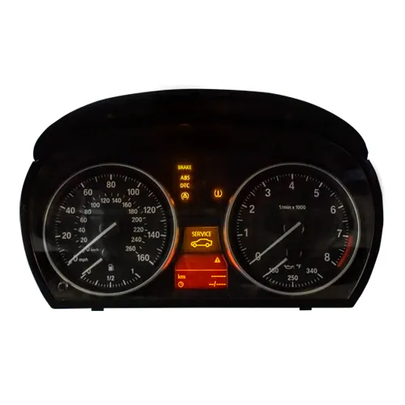
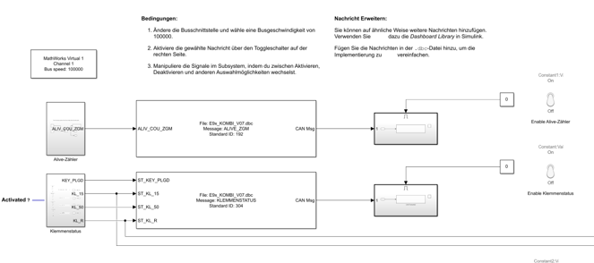

# Instrument Cluster — CAN Bus Control

> **Status: completed.** University project (WiSe 2024/25), kept as a reference implementation.

**MATLAB/Simulink model and DBC file to drive a real BMW E9x instrument cluster over CAN.**

Developed as part of the Master's course *Embedded systems and networking of mechatronic systems* (Mechatronics & Robotics, Frankfurt UAS, WiSe 2024/2025).

**Team project.** My part: signal modelling and control of the cluster over CAN (DBC file, Simulink CAN model, validation in the CAN Explorer on the real cluster).

| Instrument cluster | Simulink model |
|---|---|
|  |  |

*Left: illustration of a BMW E9x instrument cluster (stock image, not a photo of the project setup). Right: excerpt of the Simulink model.*

---

## Project Goals

- Drive a functional instrument cluster with real CAN message definitions
- Create and maintain a `.dbc` file covering all relevant cluster signals
- Control the cluster signals interactively from a Simulink dashboard (sliders, switches, combo boxes, gauges)
- Provide an extensible architecture for adding new signals

---

## System Architecture

```
┌─────────────────────────────┐
│  Simulink dashboard         │  (can-signal-sim.slx)
│  - Sliders, switches,       │
│    combo boxes, gauges      │
│  - Signal values set by hand│
└──────────────┬──────────────┘
               │ Simulink CAN Pack / CAN Transmit blocks
               ▼
┌──────────────────────────────┐
│  Vehicle Network Toolbox     │  CAN channel (virtual or hardware)
│  CAN channel (Peak/IXXAT/…)  │
└──────────────┬───────────────┘
               │ Physical / virtual CAN bus
               ▼
┌──────────────────────────────┐
│  BMW E9x Instrument Cluster  │  (real hardware)
└──────────────────────────────┘
```

---

## Technical Overview

| Layer | Technology |
|---|---|
| Signal definition | DBC file (`bmw-e9x-can-database.dbc`) |
| Signal model | MATLAB/Simulink (`can-signal-sim.slx`) |
| CAN transmission | MATLAB Vehicle Network Toolbox |
| Project management | MATLAB Project (`simulation.prj`) |

### DBC File

The `bmw-e9x-can-database.dbc` file defines 14 CAN messages and their signals for the BMW KOMBI (Kombiinstrument). Key signals include vehicle speed, engine speed, indicator and warning lamps, terminal status (ignition), transmission display, seat-belt state, time and date, and raw fuel-tank sensor data.

---

## Requirements

| Tool | Version |
|---|---|
| MATLAB | R2024b |
| Simulink | R2024b |
| Vehicle Network Toolbox | R2024b |
| CAN interface | Any interface supported by the Vehicle Network Toolbox (e.g. Peak PCAN, IXXAT, Vector) |

For the real cluster a CAN interface is required; a virtual CAN channel can be used to test the model without hardware.

---

## Getting Started

1. Open MATLAB R2024b.
2. Open the project file: `PKW/simulation.prj`
3. Open the Simulink model: `can-signal-sim.slx`
4. Configure the CAN channel in the **CAN Configuration** block. The model is saved with the MathWorks virtual CAN channel; select your CAN device to drive a real cluster. If MATLAB reports a missing DBC file, point the **CAN Pack** blocks to `PKW/bmw-e9x-can-database.dbc`.
5. Run the model (`Ctrl+T`).

---

## Project Structure

```
Instrument-Cluster/
├── images/
│   ├── instrument-cluster-hardware.png     Illustration of the cluster (not the project setup)
│   └── instrument-cluster-simulation.png   Simulink model screenshot
├── PKW/
│   ├── bmw-e9x-can-database.dbc            CAN signal database
│   ├── simulation.prj                      MATLAB project file
│   └── can-signal-sim.slx                  Simulink model
└── README.md
```

---

## License

Copyright (c) 2026 Mutasem Bader — All Rights Reserved.  
Viewing is permitted. Copying, modifying, or submitting as own work is strictly prohibited.  
See [LICENSE](LICENSE) for details.
